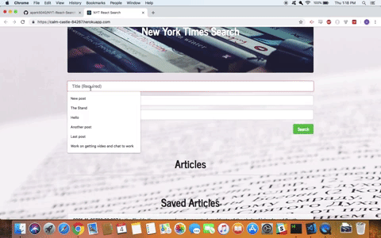
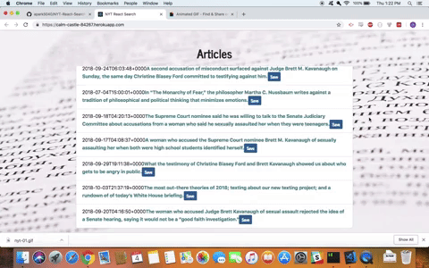
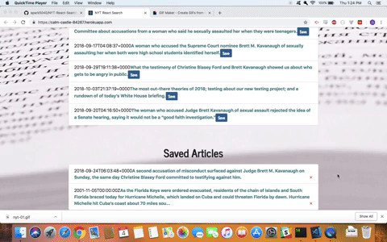

# NYT React Search

https://calm-castle-84267.herokuapp.com/

# Overview

This site uses the New York Times API to search for articles and displays it on the page. Users have the option to save articles and have it displayed under the "Saved Articles" section. The saved articles will persist after closing the window or searching for new articles. 

This was built with React, Express, and MongoDB. 

# Instructions

User must type in a "Title", "First year", and "Last Year" to search for 10 articles related to the "Title" within the year range. 

User can save the articles by clicking the save button. 

User can also delete a saved article by clicking on the "x" next to an article. 

And finally, the article headline can be clicked on to redirect the user to the actual article page on NYT. 
